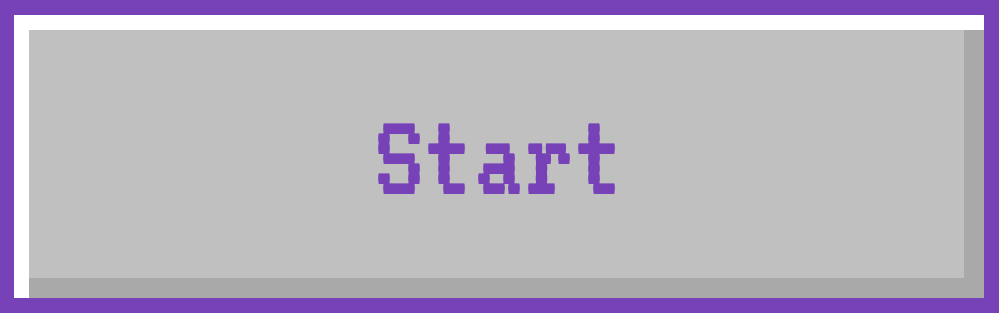

# Y2K Button – A Retro Click

A nostalgic Y2K-style button built with pure HTML + CSS.  
Featuring a grey base, 3D border effect, and a bold purple punch.

---

## 🌐 Live Preview  
[👉 Click here to try the button](https://nerminmadeiit.github.io/y2k-button/)

---

## What This Is

This button was made to feel like it came straight out of 2002.  
It’s clean, coded from scratch, and perfect for adding a nostalgic touch to your site.

- No JavaScript.  
- No libraries.  
- Just classic HTML + CSS with vibe.

---

## Design Vibes

- **3D pseudo-border** for that retro depth  
- **Grey base:** `#c0c0c0`  
- **Electric purple border:** `#7442bb`  
- **Soft lilac hover:** `#a675fc`  
- Pixel-style font using **VT323**  

---

## How to Use

1. Download or clone this repo  
2. Open `index.html` in your browser  
3. Copy the HTML & CSS into your own project  
4. Customize the color, text, or size if you like

## Created by

xoxo, **coded by Nermin** © 2025  
All rights reserved to Nermin  

Built with heart, beauty, and purpose - just like you 💖  
Follow me on [Instagram](https://instagram.com/nerminmadeit)  

## License

Feel free to use, remix, and share this project - personally or commercially.  
You don’t need to credit me… but it would make my day if you did 💖

Please don’t resell or claim it as your own.

With love,  
**Nermin**

